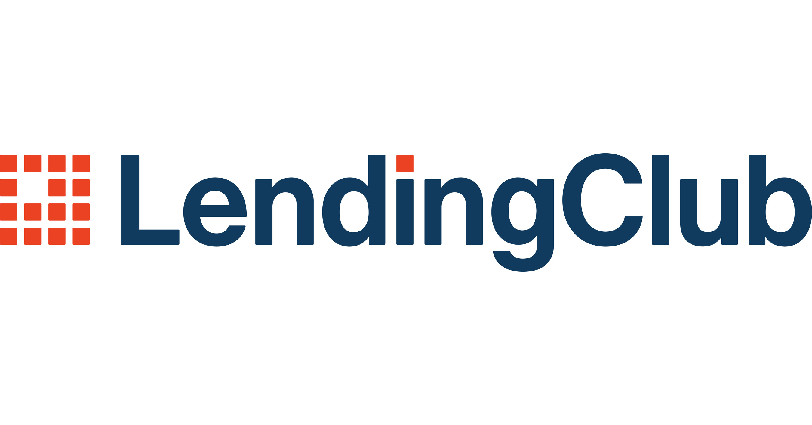

# Lending Club Loan Default Prediction

This project uses a machine learning approach to predict loan defaults for Lending Club loans. By analyzing various borrower attributes, this model can classify loans as either at risk of defaulting or performing, enabling more informed lending decisions.

## Project Overview

This project leverages the Lending Club dataset from Kaggle, applying data cleaning, feature engineering, and machine learning techniques to build a robust predictive model. Multiple models were explored, including Random Forest, XGBoost, Linear Regression, Logistic Regression, and a neural network model, each tuned to maximize accuracy and minimize overfitting.

## Table of Contents

- [Dataset](#dataset)
- [Project Structure](#project-structure)
- [Feature Engineering](#feature-engineering)
- [Modelling](#modelling)
- [Data Cleaning and Preprocessing](#data-cleaning-and-preprocessing)
- [Result](#result)
- [Future Work](#future-work)
- [Acknowledgments](#acknowledgments)

## dataset

The dataset is sourced from [Kaggle’s Lending Club dataset](https://www.kaggle.com/wordsforthewise/lending-club). It contains various features related to borrower creditworthiness, loan characteristics, and employment details. The target variable is `loan_default`, indicating whether a loan has defaulted or is at high risk.

## data cleaning and preprocessing

- **Handling Missing Values**: Imputed missing values in several columns including  the 'dti' column using a Linear Regression model based on correlated features.
- **Outlier Detection**: Developed functions to identify and optionally remove outliers based on statistical thresholds.
- **Encoding**: Applied label encoding and one-hot encoding for categorical variables as appropriate.

  
## feature engineering

Key features for this analysis include:

- **Numerical Features**:
  - `loan_amnt`, `int_rate_clean`, `installment`, `term_numeric`, `annual_inc`, `emp_length_int`, `dti`, `fico_range_high`, `revol_util`
- **Categorical Features**:
  - `grade`, `sub_grade`, `income_category`, `fico_risk_group`, `loan_term_risk`, `purpose_group`
Several new features were engineered to enhance the model's predictive capability. These features were designed based on financial domain knowledge and the characteristics of the data:

- **Income Category (`income_category`)**: Categorizes annual income into three groups:
  - **Low**: Income below $50,000
  - **Medium**: Income between $50,000 and $100,000
  - **High**: Income above $100,000

- **Debt-to-Income (DTI) Risk (`high_dti_risk`)**: Flags high DTI as risky if DTI is above 35%, indicating higher financial vulnerability.

- **FICO Risk Group (`fico_risk_group`)**: Classifies borrowers based on FICO credit scores:
  - **Poor**: Score below 580
  - **Fair**: Score between 580 and 670
  - **Good**: Score between 670 and 740
  - **Excellent**: Score above 740

- **Recent Inquiry Flag (`recent_inquiry_flag`)**: Indicates recent credit inquiries. Flags records with more than two inquiries in the past six months as potentially higher risk.

- **Loan-to-Income Ratio (`loan_to_income_ratio`)**: Measures the loan amount as a proportion of annual income, highlighting cases where the loan amount might be disproportionate to the borrower’s income.

- **Interest-to-Income Ratio (`interest_to_income_ratio`)**: Calculates the monthly installment as a proportion of annual income to gauge affordability and potential payment burden.

- **Loan Term Risk (`loan_term_risk`)**: Differentiates between loan terms, flagging loans as **Long term** for 60-month terms, which may carry more risk than shorter, 36-month terms.

- **Delinquency Risk (`delinquency_risk`)**: Flags borrowers with any record of delinquency in the past two years as higher risk.

- **Public Record Flag (`public_record_flag`)**: Indicates if a borrower has any public record of bankruptcy or other financial issues, signaling potential financial instability.

- **Home Ownership Risk (`home_ownership_risk`)**: Classifies homeownership status, differentiating between more stable ownership statuses (e.g., **MORTGAGE** and **OWN**) and more transient statuses (e.g., **RENT**).

- **Purpose-Based Default Risk Grouping (`purpose_group`)**: Groups loan purposes to assess risk by purpose:
  - **Personal**: Includes credit card, home improvement, and major purchases.
  - **Business**: For small business loans.
  - **Other**: For all other purposes.

These engineered features were designed to capture nuanced aspects of borrower behavior and financial risk, enhancing the model's ability to predict loan defaults accurately.

## modelling

The following models were developed and tested to predict loan defaults:

1. **Random Forest Classifier**: Implemented with Synthetic Minority Oversampling Technique (SMOTE) for class balancing, and optimized with a grid search for best parameters.
2. **XGBoost**: Best parameters used were `{ 'colsample_bytree': 1.0, 'learning_rate': 0.01, 'max_depth': 10, 'n_estimators': 100, 'subsample': 0.8 }`, achieving an accuracy of ~80%.
3. **Neural Network (Challenger Model)**: A deep learning approach, experimenting with architectures, optimizers, and activation functions to improve performance and reduce overfitting.
4. **Logistic Regression**: A baseline model for more complex models to provide interpretability and comparison.
5. **Linear Regression**: Tested for preliminary analysis, though not used in the final classification approach.

## results

The XGBoost model with SMOTE balancing achieved an accuracy of ~80% and was selected as the baseline model. The neural network model (Challenger Model) is under development, with experiments focusing on reducing overfitting through hyperparameter tuning and hidden layer adjustments.

Both Logistic and Linear Regression were used as baselines to provide interpretability and comparison, though they showed lower predictive performance than the XGBoost model.

## future work

- **Model Refinement**: Further tuning of neural network parameters to optimize accuracy.
- **Interpretability**: Implement SHAP or LIME for feature importance and model explainability.
- **Deployment**: Deploy the model as an API using FastAPI for potential production use.

## acknowledgments

I would like to extend my heartfelt thanks to **Andrea Baroni** for his invaluable help and instruction throughout this project. His guidance has been instrumental in enhancing my understanding of the data and improving the model's performance.

